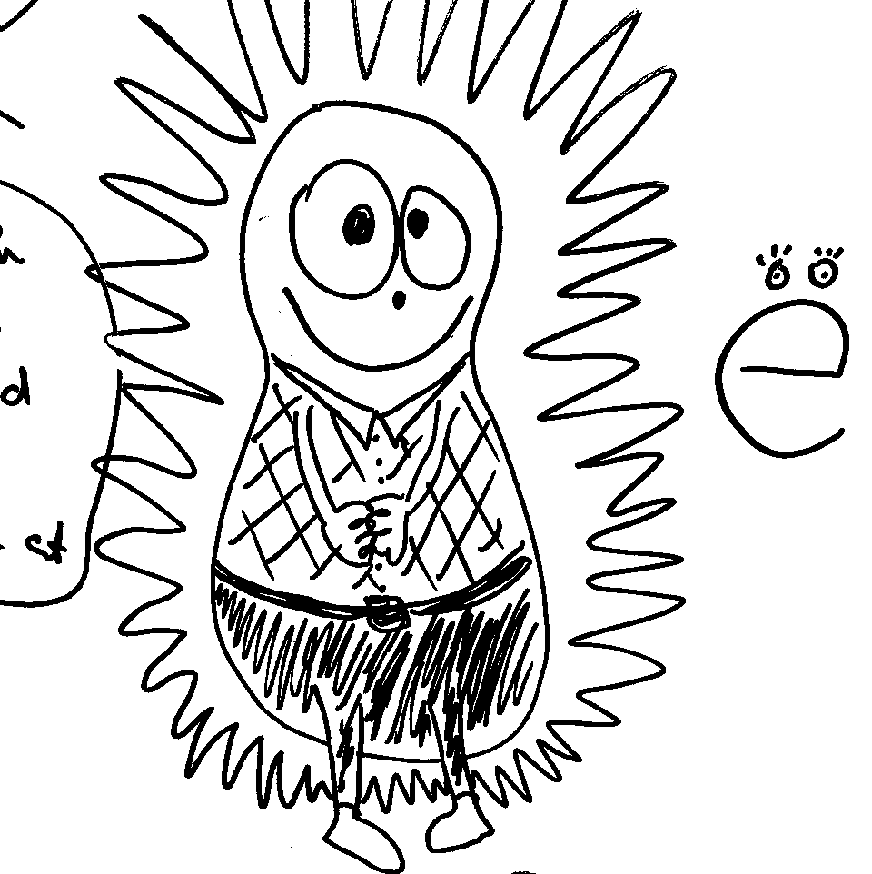

<!DOCTYPE html>
<html lang="en">
<head>
    <meta charset="UTF-8">
    <title>Document</title>
</head>
<body>
<header>Test Header
<nav></nav></header>
<section>
    Hello, world!
    <article>Article</article>
</section>
<aside>aside </aside>
<footer>FOOTER</footer>
</body>
</html>
